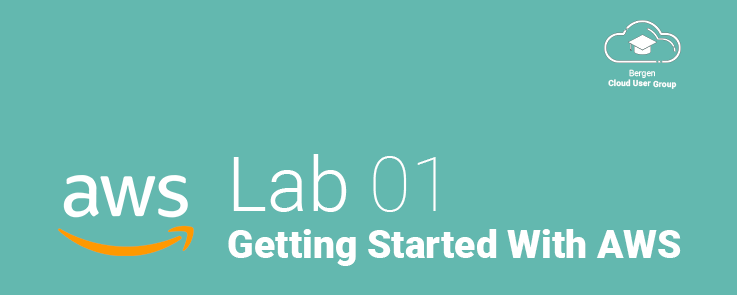

# Lab 01 - Getting Started with AWS

## Welcome!
Welcome to the Bergen Cloud User Group!

At the end of this lab, you will have created a Amazon Web Services account and secured it according to best practices. With this account, you will have access to one full year of AWS Free-Tier services, allowing you to create and utilize AWS Services for free up to certain limits. We highly recommend that you spend a couple of minutes and read about the free-tier limits at [https://aws.amazon.com/free/](https://aws.amazon.com/free/)

## Before You Begin
### About AWS Free Tier
Amazon Web Services (AWS) provides one year of free services to **new** accounts. If you have an existing account, you could potentially not be eligable for the free tier, and as a result, completing the following labs, *may* incour you costs. To avoid this problem, we recommend creating a new account, which is free, even if you have an existing account.

### AWS CLI and Web Console
There are two ways to follow along with the labs in this workshop:

1. Follow along in the AWS Console, and click the appropriate buttons to complete the configuration.

2. Use the AWS CLI for your operating system. Everything you can do in the AWS Console, you can do with the AWS CLI from your computer. Learning the AWS CLI can be very useful and allows for scripting of commands and automatically building and tearing down configurations once you are done. We will provide complete [CloudFormation](https://aws.amazon.com/cloudformation/) templates that will allow you to easily build and tare down each step in the guide.

 > There is nothing wrong with either alternatives, and they are both perfectly legitimate ways of interacting with AWS. In fact, most people work with a combination of both tools depending on what task they are doing. However: We do recommend that you configure your AWS CLI and try it out, even if you want to primarily use the web console, as there are some things, like CloudFormation that require that you use the CLI.

## Getting Started
### 1. Creating an AWS Account
* Go to [https://aws.amazon.com](https://aws.amazon.com) and click the **Create an AWS Account** in the *top right* corner of the page.
* Input your email address and select a root password.
  * We **highly recommend** that you use a password manager such as [1Password](https://1password.com) to generate a 20+ character password. This password will only be used for your *root* account, and will not be one that you use regularly, however it will have full access to all AWS services in your account and it would be very bad if the account was compromised!

* Select an AWS account name. This can be anything you wish, and it will be the account name that you will use when signing in.

### 2. Contact Information
* Select *personal account* unless you have an organization you want to connect your account to.
* Input your phone number, country and address information.
* Read the user agreement and check that you have read and agree to the terms.

### 3. Payment information.
This step is **mandatory** to complete as well, and you **must** input a **valid** creditcard in order to create an account. You will be charged $1 USD to the card, that will be refunded to you in a couple of days after creation.

 > **NOTE:** As long as you follow along with this lab, your card will not be charged for any usage, unless you on your own, start up services or leave them running so that you exceed the Free Tier limits.

> Later in this lab, *we will create an e-mail alert that will warn you if you approach or exceed the free-tier limits*.

* Fill out a valid creditcard and complete the form.

### 4. Identity Confirmation
* Finally, confirm your itentity via SMS or a robot call.

### 5. Support Plan
* Select the **Basic Plan** (Free). We do not need support from AWS at this time.

### 6. Complete!
We have now successfully created an AWS account and we are ready to continue!

You will be presented with a screen filled with tutorials that can help you get started with AWS. Note that many of these tutorials are *not* included with the free tier, so make sure you understand what is covered before trying the tutorials not specifically marked with Free Tier.

Click the Sign In To the Console to continue.

&nbsp;
&nbsp;

---

<a href="../02 - Basic Security Best Practices">Lab 02: Basic Security Best Practices →</a>

Continue to the next lab:
# [Lab 02: Launching A Virtual Machine]()
