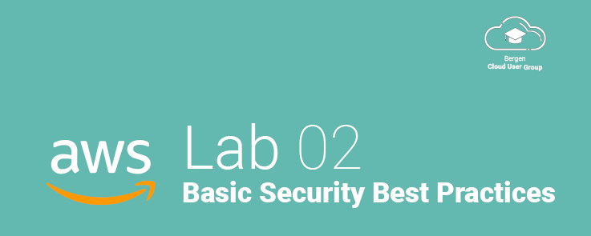
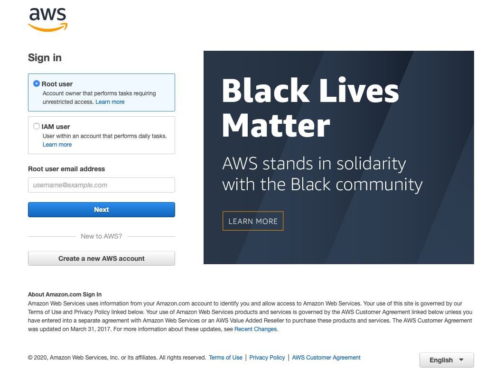
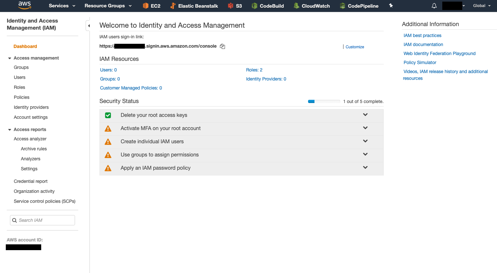
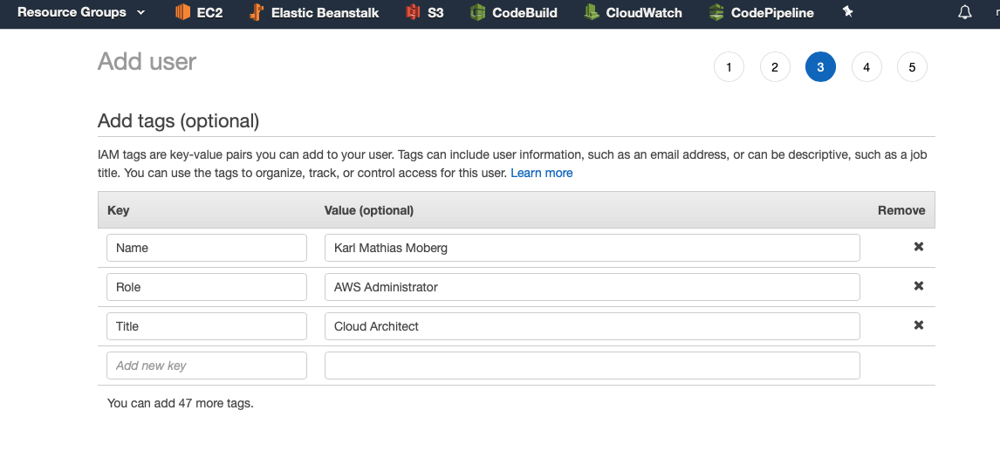

# Lab 02 - Basic Security Best Practices

## Introduction
In this step, we will complete several steps to secure our AWS account and comply with AWS Security Best practices.

The account you just created and can now sign in with is known as the **root account**. This account has complete access to your entire AWS account, and in general, you should avoid using this account in your regular day-to-day use.

The [official AWS documentation (link)](https://docs.aws.amazon.com/IAM/latest/UserGuide/id_root-user.html) has this to say on the subject:

>**Important!**
We strongly recommend that you not use the root user for your everyday tasks, even the administrative ones. Instead, adhere to the [best practice of using the root user only to create your first IAM user.](https://docs.aws.amazon.com/IAM/latest/UserGuide/best-practices.html#create-iam-users) Then securely lock away the root user credentials and use them to perform only a few account and service management tasks. To view the jobs that require you to sign in as the root user, see AWS Tasks That Require Root User. For a tutorial on how to set up an administrator for daily use, see Creating Your First IAM Admin User and Group.

In this lab, we will first secure the root account, then create an IAM administrator user that you can use for your daily administration. Having one IAM account per user of the AWS Account will provide accountability and traceability, allowing you to quickly identify who has provisioned resources, created or deleted security groups, etc.

## Securing the Root Account
Start by signing in to your AWS account using the root credentials you created in the previous lab.

**NOTE:** If you are presented with a sign-in screen asking you to select the type of account to log in to, select **Root user**.

### Signing In

* Sign in with the e-mail address of the **root account** and click next.

* Enter your password on the next screen.

### Enabling MFA for the Root Account
When you're signed in, you are greeted by the AWS Management Console. The AWS Console is where you will be managing everything related to your AWS account.

We want to manage our users' identity, which you can find in the *Identity and Access Management* panel, also known as **IAM**.

* In the Top Menu Bar, click **SERVICES**
* In the menu, locate **IAM** under **Security, Identity & Compliance**, or use the search feature to search for **IAM**.

From the IAM panel, we can create users, groups, policies, and more, which we will go into greater detail about in a later workshop. For now, focus on the big panel front and center, marked **Security Status**. This panel is continuously updated and will inform you about some primary security status items for your account that AWS deems essential. As you can see, we need to configure multiple things here to be compliant.

* The first thing we must do, is activated MFA (Multi-Factor Authentication) on our root account. Click the row in the Security Status to go straight to the appropriate panel.
* Click Multi-Factor authenticator
* Select the type of MFA device you wish to use. In most cases, a Virtual MFA device using [1Password](https://1password.com), [Google Authenticator](https://support.google.com/accounts/answer/1066447?co=GENIE.Platform%3DiOS&hl=en&oco=0), [Microsoft Authenticator](https://www.microsoft.com/en-us/account/authenticator) or any other MFA device will suffice.
    * If you have a U2F Security key, you can also use it as an MFA device!

* Click on **SHOW QR** code to display the QR code and scan it with your MFA device.
* Once done and added to your MFA app, you need to enter **TWO CONSECUTIVE CODES** from the MFA device into the AWS Console! This means that you will have to wait for the second code to be generated and take up to 60 seconds.
* Click completely to finish the process. MFA is now active on the account, and your root account is much more secure!

### Creating an IAM Administrator Account
* Now that the root account is secure, we want to create an IAM user for you to use as your daily administrator account.
* Click to go back to the IAM Dashboard.
* Select the **Create individual IAM users** dropdown from the Security Status and select Manage Users.
* Click **Add User**
* Give your account a name, and select **** *programmatic access* and *AWS Management Console Access .* This will give your IAM user access to both the AWS CLI and the AWS console itself.
* Either autogenerate a password or select a custom password. If you choose a custom password, make sure it is a **strong** password of 15+ characters with symbols and numbers. Use a password manager such as [1Password](https://1password.com) to save the password for you.
* If you are creating the account for yourself, remove the checkmark next to **Require password reset**.

#### IAM Permissions
We will go into IAM permissions in a later workshop, so now, follow the instructions, and we will cover each step in detail later.

In this step, we will create a group for administrators with **full access** to the AWS Account.

* Click **Create Group** to create an Administrators Group.
* Call the Group: **"AWS-Global-Admin"**.
* Add the policy **AdministratorAccess** by checking the box next to it.
* Click **Create Group**.

* Click **"Next: Tags"** at the bottom of the screen.
* At this point there is no need to add tags to this user, so you may skip this step if you wish, but you can also enter in key-value pair format, things such as:
    * Name: Your Name
    * Role: Your Role
    * Title: Your Title
    * Etc.

> **NOTE**: Tags are cAsE sEnSiTive, meaning that **Name** and **name** are considered **different** tags!

* Click **"Next: Review"**.
* Verify that the information is correct.
* Click **"Create User"**

** **VERY IMPORTANT:** This screen contains an *Access key ID* and a *Secret access key* which can only be seen on this screen, once!** You **must** remember to store both of these keys, as they will be important when configuring the AWS CLI! They **cannot** be recovered, only regenerated!

* Your user has now been created, and you can sign in using the URL shown in the Success box. Don't worry if it looks like a complicated URL; we will fix this soon!
* Click "Close" to end the wizard and return to the IAM Dashboard.

### Creating an IAM password policy
Finally, the last step in the security status check is to apply an IAM password policy. This policy will dictate password length and complexity requirements, and things such as password expiration dates, and it is up to you how you wish to configure this policy.

A couple of recommendations:

* We suggest requiring 15+ character passwords to encourage the use of password managers.
* We suggest **requiring** the use of MFA devices for **all users** as this *significantly* increases account security.
* IF you have forced MFA, we (and NIST) recommend setting the password expiration to infinite, or 365 days as research has shown that forcing password changes often, significantly reduces the complexity of the passwords that people use.

* Click on "Apply an IAM password policy" to get started.
* Select "Set password policy."
* Pick the options and set the requirements for your organization.
* Save the policy to apply it.

Your accounts are now compliant!

### Enabling MFA on your new IAM account
To enable MFA on your newly created IAM account:

* Click on "Users."
* Select your new user.
* Select the tab "Security Credentials."
* Click on "Assigned MFA device" - "Manage."
* Follow the same steps as for the root user.

> **Note:** You can use the same MFA app for multiple users! Just create a new entry in your MFA app. Make sure to label them in the app, so you know which code is for which account!

&nbsp;
&nbsp;

---

<a href="../01 - Stage 1">← Lab 01 - Getting Started with AWS</a>

<a href="../03 - Launching an EC2 Instance">Lab 03: Launching an EC2 Instance →</a>

