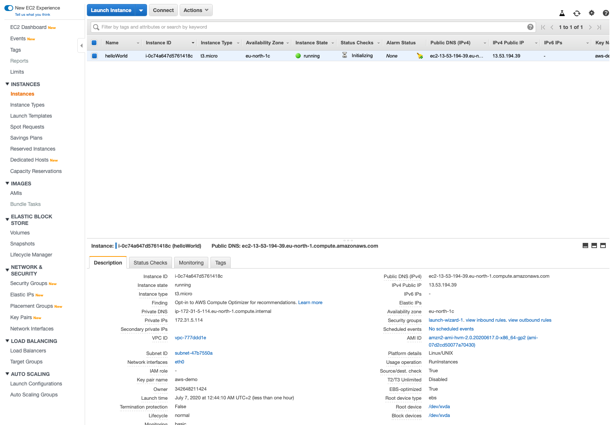
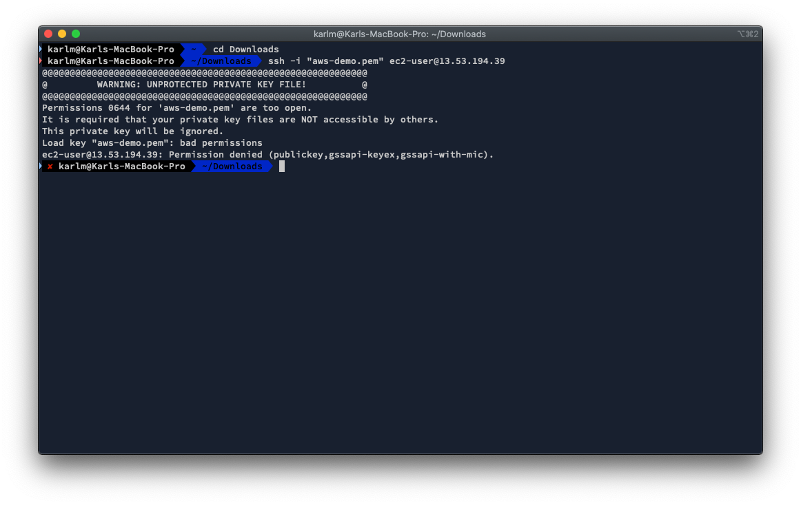
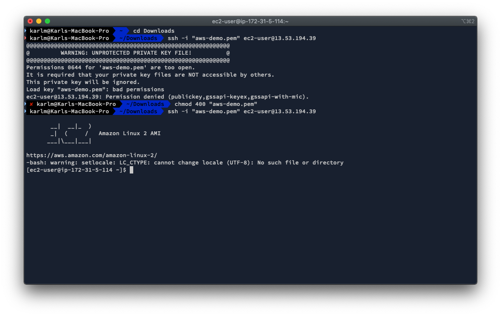
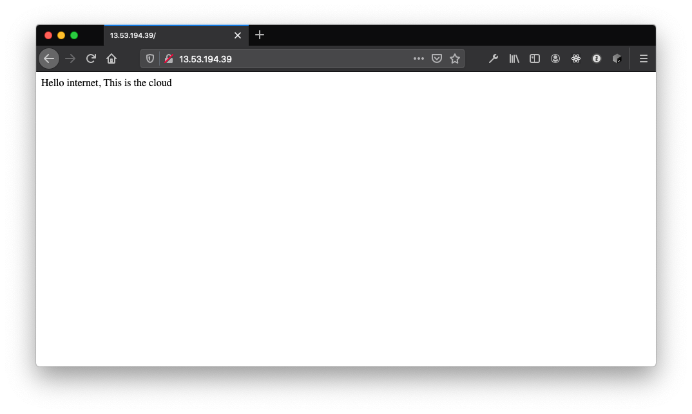

# Lab 03 - Launching an EC2 Instance


## Introduction
[Amazon EC2](https://aws.amazon.com/ec2/) is one of the pillars of Amazon Web Services, and is the way you can launch a virtual machine, in the Amazon Cloud. EC2 instances function like any virtual machine that you create, except you in this case will connect to AWSs servers instead of your own.


## Before You Begin
In this lab, we will launch instances in the AWS cloud, all within the free-tier, and as long as your account is free-tier eligable and you follow the instructions in the , you will not be billed for the resources you are creating.

Please do remember to terminate and/or delete any instances or volumes you create.

We will utilize Linux instances in this lab. If you have not used Linux in the past - no fear, we will show you the few instructions you need to know to get started.

> **IMPORTANT**: AWS Uses **REGIONS** when launching EC2 instances. Each instance you launch will only be available in the region you select. You **MUST** select your appropriate region **before** you launch the instance! You can switch region in the **top right** of the AWS console by clicking the region name, and then selecting the region you want. For these labs, it doesn't matter which region you pick, but we do recommend that you select the region closest to you. In our case, we will select the *Stockholm* region.

### Requirements
You will need some form of terminal emulation program on your computer in order to connect to the Linux instances.

* If you are on macOS or Linux, you can use the built in Terminal.
* If you are on Windows 10, you will need to download a terminal application.
    * We recommend [GitBash](https://git-scm.com/downloads) which, when installed, will allow you to follow along with the instructions in the same way Mac and Linux users use it.


## Getting Started
### 1. Launching Your First Instance
Launching EC2 instances is not a lot of work, but the first time you launch an instance, you will have to go through a few extra steps in order to configure access properly.

* Start by navigating to the EC2 management console by clicking **Services** in the top menu, then selecting **EC2** under **Compute**.
* Click on **Launch Instance**
* Select the *Amazon Linux 2 AMI (HVM), SSD Volume Type*, make sure it is marked with "Free tier eligible".
* Select the **t3.micro** instance type - again, make sure it is marked with "Free tier eligible".
* Click on **Next: Configure Instance Details** - NOT Review and Launch, as we need to configure some options in the next few pages.


* Remove the checkmark next to T2/T3 unlimited.
* In the field marked "User data" enter the following *bootstrap script*

```bash
#!/bin/bash
yum update -y
yum install httpd
systemctl start httpd
systemctl enable httpd
echo "Hello internet, This is the cloud" > /var/www/html/index.html
```
This script will update Linux on the instance and install the Apache web server, start it and enable it through reboots. It will finish by adding an index.html file that says "Hello internet! This is the cloud!".


* Click on add storage
* Leave the defaults and move on to "Add Tags"
* Add any tags you wish, one recommendation is to add the tag `Name` which will name your instance. Note the tags are casesensitive!
* Move on to add security group

#### Security Group
This is where you restrict access to the server instance. The default is to allow SSH from anywhere (indicated by the source 0.0.0.0/0). As we are going to be terminating this instance pretty quickly, you can leave SSH exposed to the internet like it is for now, but for production, this is **not recommended!** and is very bad practice to do so.

In the bootstrap script we installed the Apache web server, and we want to allow internet access to this server.

* Click on **Add rule**
* Select type **HTTP** and leave the defaults. It should default the source to `0.0.0.0/0` and in some cases with adding `::/0`. This is fine.

* Finally, click on *Review and Launch*
* Launch the instance with the **Launch** button in the bottom right.

#### Key Pair
To connect via SSH, we are going to use SSH-key-pairs. There is **no** password access to AWS EC2 instances, but AWS instead use key pairs. It stores one public key on the server, while you keep the private key.

If you have an existing SSH-key-pair that you wish to use, you can upload the public key to AWS and let AWS use it as the security token, or you can create a new key pair from this screen.

* To do so, select **create a new key pair** from the drop-down menu, and give it a name. The name doesn't matter.
* Click **Download Key Pair**.
* Click Launch Instance

The instance is now starting up. To check on the progress, click on **View Instances**.

## 2. Connecting to the EC2 Instance


* Once the instance is marked with the status *running*, you can connect to the instance. You will find the DNS name and IP address by clicking on the instance and looking in the Description tab at the bottom. Look for the **IPv4 Public IP** and click it to copy it.

* Open your Terminal application and navigate to where you stored the SSH Key file you downloaded in the last step, in my case:

```bash
cd ~/Downloads
```

From that directory, you connect to the instance by passing in **your** `SSH Key Name` and the `IPv4 address` into the command. If you get a message about trusting the IP, type `YES`:

```bash
ssh -i "your-keyname.pem" ec2-user@YOUR-IP-FROM-AWS
```

For example:

```bash
ssh -i "aws-demo.pem" ec2-user@13.53.194.39
```




* You will be prompted with an ERROR message! This is because the permissions for the file are wrong and you need to protect it. Do this by issuing the command:
```bash
chmod 400 "your-keyname.pem"
```

* Try connecting again to the instance, using the same command as before.
* Congratulations! You are now connected to the cloud instance!



## Check that Apache is working
You can also check that Apache is working by opening the IP address in a browser of your choice. If everything has worked, it should return the message we created earlier.




&nbsp;
&nbsp;


---
<p align="left"><a href="../02 - Basic Security Best Practices">← Lab 02: Basic Security Best Practices</a></p>
<p align="right"><a href="../04 - ">Lab 04:  →</a></p>

