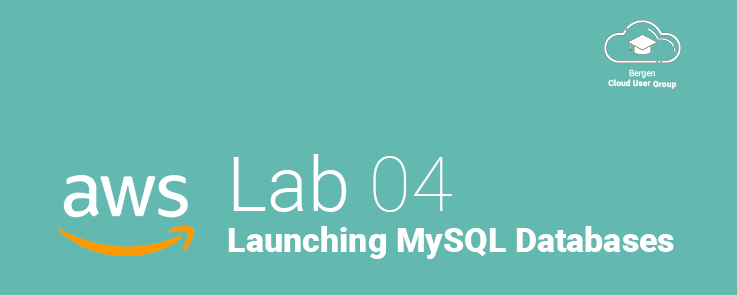
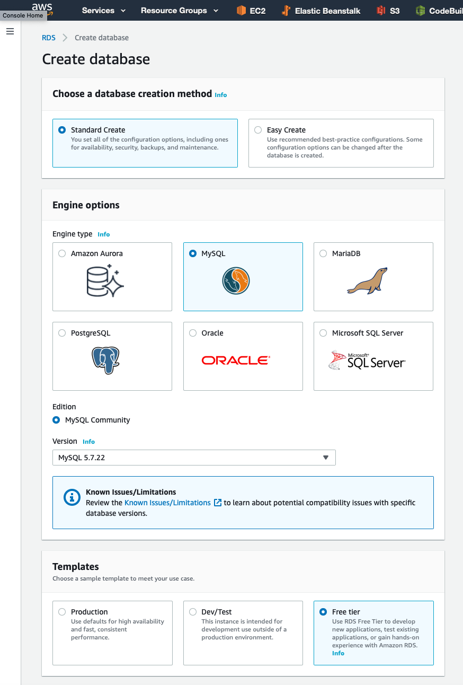

# Lab 04 - Launching a MySQL Database

## Welcome!
In this lab, we'll be launching a MySQL database using AWS managed database service, RDS.
This lab is, as long as you are eligable, still within the free-tier.

We will also demonstrate how you can allow an EC2 instance access to the MySQL server, and block the rest of the internet.

## Before You Begin

* You will need a working EC2 instance in order to connect to the MySQL database. If you have terminated the instance from the previous lab, you will need to create a new one.

> **IMPORTANT** Please note that some AWS RDS Regions do not, by default support the creation of free-tier RDS Instances! You may need to switch to US-EAST-1 to do this lab. When switching regions, most of your existing work in another region will *NOT* transfer over, and things like Security Groups, VPCs, SSH-Key-Pairs and more will not carry over and you will need to redo the work.

If you still wish to do this in your existing region, you may or may not be charged for the time, but as long as you select a T2/T3.Micro database, the cost will most likely be less than $1 for the few minutes we have a database active. If you leave your database running, the monthly cost will average $15-20 a month, however we cannot guarantee this.

> Please note that for this lab, we will ensure that the database will be within the AWS free-tier. This is *not* recommended for a production workload, or even a critical development environment. For this, we recomend checking out the AWS Documentation on [AWS RDS High Availability](https://aws.amazon.com/rds/ha/).

## Getting Started
### 1. Launching an RDS Instance

Just like launching an EC2 instance in the previous lab, launching an RDS instance is very simple! The only things we need to be concerned about is what type of database we want to launch, and what options we should enable.

* Start by navigating to the AWS console, and selecting **RDS** from the Services menu.
* You may be prompted to launch a [AWS Aurora Cluster](https://docs.aws.amazon.com/AmazonRDS/latest/AuroraUserGuide/CHAP_Aurora.html) **DON'T** do that for this lab! Aurora is an amazing RDS alternative, but is not free-tier eligable and is fairly expensive.
* Click on **Create Database**
    - Make sure your correct region is listed! You may need to select US-EAST-1 to stay within the free-tier.
* Select **MySQL** as the database engine.

* Select the **Free Tier** Template
* Pick a database name, username and strong password.
* Leave Instance Size to default.
* Remove the checkbox next to "Enable Storage Autoscaling"
* Select Password Authentication
* Click **CREATE DATABASE** to finish creating the database.

### 2. Configuring Security

&nbsp;
&nbsp;

---

<a href="../01 - Stage 1">← Previous Step</a>

<a href="../03 - Launching an EC2 Instance">Next Step →</a>

