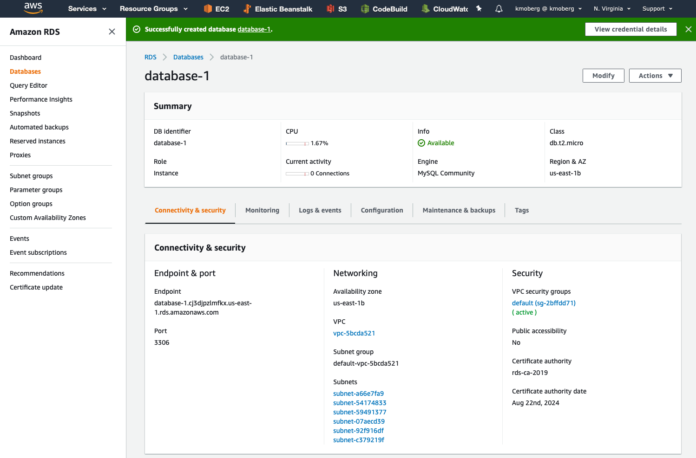
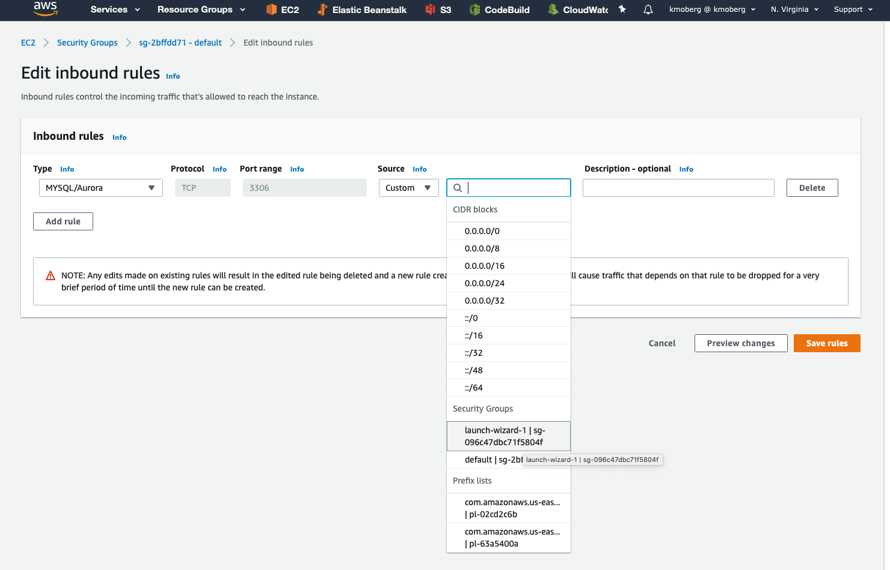
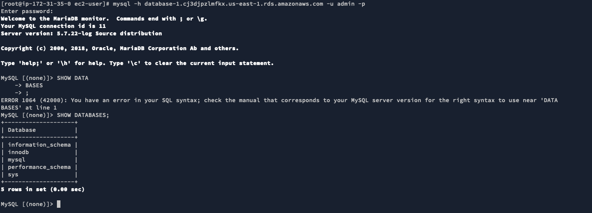

# Lab 04 - Launching a MySQL Database


## Welcome!
In this lab, we'll be launching a MySQL database using AWS managed database service, RDS.
This lab is, as long as you are eligible, still within the free-tier.

We will also demonstrate how you can allow EC2 instances access to the MySQL server, and block the rest of the internet.

## Before You Begin

* You will need a working EC2 instance to connect to the MySQL database. If you have terminated the instance from the previous lab, you will need to create a new one.

> **IMPORTANT** Please note that some AWS RDS Regions do not, by default, support the creation of free-tier RDS Instances! You may need to switch to US-EAST-1 to do this lab. When switching regions, most of your current work in another region will *NOT* transfer over, and things like Security Groups, VPCs, SSH-Key-Pairs, and more will not carry over, and you will need to redo the work.

If you still wish to do this in your existing region, you may or may not be charged for the time, but as long as you select a T2/T3.Micro database will most likely be less than $1 for the few minutes we have a database active. If you leave your database running, the monthly cost will average $15-20 a month; however, we cannot guarantee this.

> Please note that we will ensure that the database will be within the AWS free-tier for this lab. This is *not* recommended for a production workload or even a critical development environment. We recommend checking out the AWS Documentation on [AWS RDS High Availability](https://aws.amazon.com/rds/ha/).


## Getting Started
### 1. Launching an RDS Instance

Just like launching an EC2 instance in the previous lab, launching an RDS instance is very simple! The only things we need to be concerned about is what type of database we want to start, and what options we should enable.

* Start by navigating to the AWS console and selecting **RDS** from the Services menu.
* You may be prompted to launch a [AWS Aurora Cluster](https://docs.aws.amazon.com/AmazonRDS/latest/AuroraUserGuide/CHAP_Aurora.html) **DON'T** do that for this lab! Aurora is a fantastic RDS alternative, but is not free-tier eligible and is relatively expensive.
* Click on **Create Database**
    - Make sure your correct region is listed! You may need to select US-EAST-1 to stay within the free-tier.
* Select **MySQL** as the database engine.


* Select the **Free Tier** Template
* Pick a database name, username, and secure password.
* Leave Instance Size to default.
* Remove the checkbox next to "Enable Storage Autoscaling."
* Select Password Authentication
* Click **CREATE DATABASE** to finish creating the database.

### 2. Configuring Security
When the database is listed as "*AVAILABLE*" (It will take several minutes for this to complete), we are ready to move on.

* Begin by clicking on the database name to configure settings.

You will be presented with more information about the database. Right now, we want to try and connect to the database from your IP only. This will allow you to log in to the database server from your computer.



* Click on the **VPC Security Group** under *Security*.
* Click on the *Input Rules* tab at the bottom, followed by **Edit Inbound Rules**.
* **Add Rule**
    - Type: *MySQL/Aurora*
    - Source: <Select your EC2 Instance> - You can find the corresponding security-group in EC2.
* Click **Save Rules**




* Return to the RDS console and locate the database settings again.
* Copy the RDS Endpoint - we'll need this in a minute.

* SSH to your EC2 instance.
* Install the MySQL Client using:

```bash
$ yum update -y
$ yum install MySQL
```

* Once installed, connect to MySQL using:
```bash

$ MySQL -h YOUR-ENDPOINT -P 3306 -u YOUR-ADMIN-USERNAME -p
```

For example:
```bash
$ MySQL -h database-1.cj3djpzlmfkx.us-east-1.rds.amazonaws.com -P 3306 -u admin -p
```



You're in! To terminate the database, return to RDS and select **DELETE** under **ACTIONS**.


&nbsp;
&nbsp;


---

<p align="left"><a href="../03 - Launching an EC2 Instance">← Previous Step</a></p>
